# GakuNin IHV prototype (OpenID Federation + vcknots)

[日本語](README.md) | **English**

A prototype of the GakuNin IHV (Issuer / Holder / Verifier) scenario in which the
**Issuer / Holder (Wallet) / Verifier** operate on top of trust chains built with **OpenID Federation**.

- Issuer / Verifier: the TypeScript library `@trustknots/vcknots` of [vcknots](https://github.com/trustknots/vcknots) (OID4VCI / OID4VP, SD-JWT VC)
- Holder (Wallet Instance): the vcknots Go wallet library `github.com/trustknots/vcknots/wallet`
- OpenID Federation (Entity Configuration / Subordinate Statement / Trust Chain resolution / metadata_policy), Wallet Attestation, the Trust List (ETSI TS 119 602 LoTE + ETSI TS 119 411-8 access certificates) and the Token Status List are implemented in this repository

A regular GakuNin SP (an e-journal platform) and an InCommon SP are also implemented as RPs that users can log in to with a GakuNin institution IdP.

## Demo (in the browser)

```bash
npm install
npm run demo        # starts every entity + the Web Wallet (Go). Requires Go 1.25+ (fetched automatically with GOTOOLCHAIN=auto)
```

Then open **<http://localhost:8790>** (the demo console).

Ports are offsets from `BASE_PORT` (default 8700); `BASE_PORT` to `BASE_PORT+90` are used.
If a port is taken, shift the range, e.g. `BASE_PORT=9700 npm run demo`
(the URLs below shift accordingly; the CLI wallet and `scripts/demo.sh` honour the same `BASE_PORT`).

| Page | URL | Contents |
| --- | --- | --- |
| Demo console | <http://localhost:8790> | Architecture diagram (click to open each entity, shows which are up), guided scenario, live timeline of what every entity does |
| Federation settings | <http://localhost:8790/federation> | Edit trust relationships at runtime to see what happens when Trust Chains break ([below](#federation-settings-breaking-trust-chains)) |
| Trust Map | <http://localhost:8790/trust-map> | Diagram and table of which entity verifies which entity, and how ([below](#trust-map-who-verifies-whom-and-how)) |
| Trust Chain Visualizer | <http://localhost:8790/trust-chain> | Draws the Trust Chain resolution of any entity ([below](#trust-chain-visualisation)) |
| Web Wallet | <http://localhost:8760> | Smartphone-style wallet: registration, receiving (checks the Issuer's trust chain), presenting (authenticates the Verifier, choose attributes to disclose), status of each card (VALID / SUSPENDED / INVALID) |
| GakuNin SP (regular SP) | <http://localhost:8725> | Log in with the Institution IdP; access control based on the received attributes (affiliation) |
| InCommon SP | <http://localhost:8750> | Log in with a GakuNin institution IdP via eduGAIN (inter-federation), Trust Chain Explorer |
| GakuNin Issuer | <http://localhost:8720> | Log in with the Institution IdP (`taro` / `hanako`, password `password`), Credential Offer, admin page (suspend / reinstate / revoke) |
| Verifier | <http://localhost:8740> | Create presentation requests, verification results (Wallet Attestation / VP / Issuer / Status List) |
| Trust List | <http://localhost:8731> | Registrar (suspend / cancel RPs), LoTE, Access CA |
| Wallet Provider | <http://localhost:8730> | Wallet Instances and their suspension / revocation |

**Switching the language**: use "日本語 | English" in the header of any page (`?lang=ja` / `?lang=en`).
The choice is stored in the `lang` cookie; cookies on localhost are shared across ports, so it applies at once to the demo console,
every entity and the Web Wallet. Without the cookie the browser language (Accept-Language) is used, Japanese by default.
Timeline events are recorded in both languages and shown in the selected one.
The output language of the CLI wallet (`wallet-instance`) is set with the `WALLET_LANG` environment variable (`ja` / `en`, default `ja`).
See `src/common/i18n.ts` (TypeScript) and `wallet-instance/i18n.go` (Go).

UI messages (timeline, errors, trust chain paths, Web Wallet verification steps, ...) show entity names such as "GakuNin Issuer" or "NII"
instead of the Entity ID URLs (e.g. `GET NII (/fetch?sub=GakuNin Issuer) -> 404`; names are defined in `ENTITY_NAMES` in `src/config.ts`
(Japanese and English) and replaced by `src/common/names.ts`; the Web Wallet gets them from `/api/entity-names` of the demo console).
"Entity ID" fields and protocol values keep the URLs.

**"Open in Web Wallet"** on the Issuer's offer page and the Verifier's request page opens the wallet instead of scanning the QR code
(pasting the URI into the Web Wallet's "Scan" page works too).

Demo flow (same as the "Demo scenario" on the console):

1. In the Web Wallet, "Register with the Wallet Provider" (obtains a Wallet Attestation)
2. Log in at the GakuNin Issuer → "Create Credential Offer" → "Open in Web Wallet" → accept
3. At the Verifier, "Create presentation request" → "Open in Web Wallet" → choose the attributes and present → the Verifier shows the result
4. Suspend / revoke on the Issuer admin page → presenting again after about 10 s (the Status List ttl) is rejected
5. Suspend the Verifier at the Trust List → the wallet rejects the Verifier (its access certificate is revoked via the CRL)
6. Suspend / revoke the Wallet Instance at the Wallet Provider → after about 10 s the Issuer and the Verifier reject the Wallet Attestation (no issuance or presentation). "Reactivate" restores it
7. Log in to the GakuNin SP and the InCommon SP with the Institution IdP (the InCommon SP gets only a minimal attribute set via eduGAIN)
8. Look at the trust chain resolution in the Trust Chain Visualizer
9. Break trust relationships in Federation settings and see issuance, presentation and login being rejected ("Restore everything" recovers)

Notes:

- Unchecking an attribute requested by the Verifier shows a warning (the DCQL query is not satisfied, so the Verifier rejects it).
- Web Wallet data lives in `.data/web-wallet/`. To clear it, press "Delete all credentials" on the home screen or delete the directory.
- The Wallet Provider's Wallet Instances and the GakuNin Issuer's issuance history are stored in `.data/` and survive restarts.
- **"⟲ Reset all"** at the top right of the demo console deletes the contents of `.data/` (all keys, Status Lists, registrations, issuance history and Web Wallet data) and restarts every entity and the Web Wallet with new keys (takes a few seconds, then returns to the console). The Trust Anchor key changes too, so a CLI wallet must re-read `.data/trust-anchor.json` (`scripts/demo.sh` reads it every time).
- With several credentials, the newest one is presented (a vcknots wallet behaviour).

| Demo console | Web Wallet (home) | Receiving | Presenting |
| --- | --- | --- | --- |
| 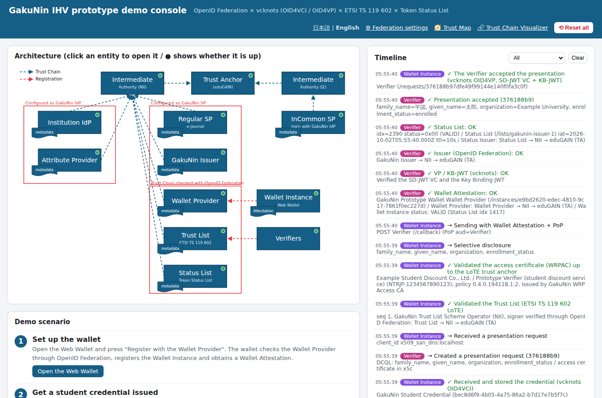 | 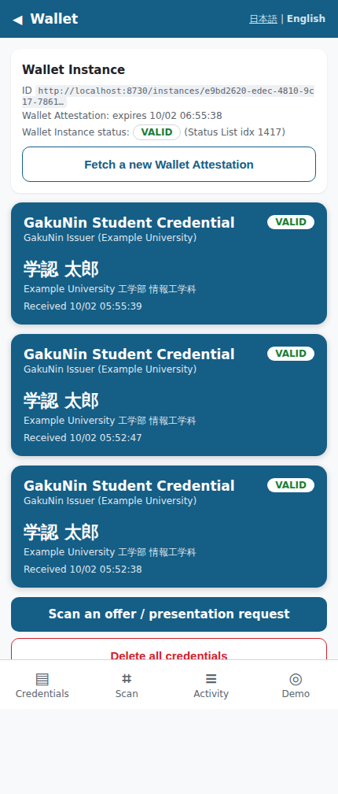 | 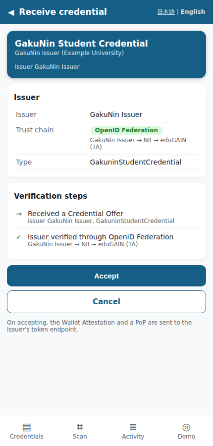 | 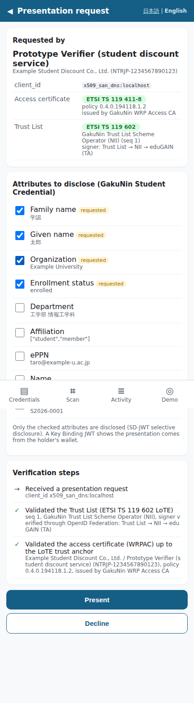 |

## Architecture (mapping to the diagram)

```
                      Trust Anchor (eduGAIN) :8700
                       ▲                     ▲
       Intermediate Authority (NII) :8701   Intermediate Authority (I2) :8702
   ┌────────────┬────────────┬──────────┬──────────┬──────────┐      ▲
 Institution  Attribute    GakuNin    Wallet      Trust List  Status List   InCommon SP :8750
 IdP :8710    Provider     Issuer     Provider    :8731       :8732
              :8711        :8720      :8730         ▲
                                        ▲           │ Registration
                                        │ Registration
                                Wallet Instance   Verifier :8740
                                (Go CLI)
```

| Element | Entity ID | Code | Role |
| --- | --- | --- | --- |
| Trust Anchor (eduGAIN) | `http://localhost:8700` | `src/services/authority.ts` | Root of trust. Registers NII / I2 as subordinates and applies the eduGAIN-wide `metadata_policy` |
| Intermediate Authority (NII) | `http://localhost:8701` | `src/services/authority.ts` | GakuNin's intermediate. Registers the GakuNin IdP / SPs and the IHV entities |
| Intermediate Authority (I2) | `http://localhost:8702` | `src/services/authority.ts` | InCommon's intermediate |
| Institution IdP | `http://localhost:8710` | `src/services/idp.ts` | OpenID Provider. Accepts RPs with **federation automatic registration** (redirect_uris / jwks come from the metadata resolved through the Trust Chain) |
| Attribute Provider | `http://localhost:8711` | `src/services/attribute-provider.ts` | Returns additional attributes such as student number and department. Verifies the requester through its Trust Chain and signs the response |
| GakuNin Issuer (configured as a GakuNin SP) | `http://localhost:8720` | `src/services/issuer.ts` | vcknots IssuerFlow / AuthzFlow. Login at the Institution IdP → Attribute Provider → issues an SD-JWT VC |
| Wallet Provider | `http://localhost:8730` | `src/services/wallet-provider.ts` | Wallet Instance registration and Wallet Attestation (`oauth-client-attestation+jwt`) issuance |
| Trust List | `http://localhost:8731` | `src/services/trust-list.ts`, `src/trust-list/` | Registrar + Access CA (WRPAC Provider) + LoTE Provider of the EUDI model. Publishes the WRPAC Providers [ETSI TS 119 602 LoTE](#trust-list-etsi-ts-119-602--ts-119-411-8) |
| Status List | `http://localhost:8732` | `src/services/status-list.ts` | Status Issuer / Status Provider of the [Token Status List (draft-ietf-oauth-status-list)](https://datatracker.ietf.org/doc/draft-ietf-oauth-status-list/) |
| Verifiers | `http://localhost:8740` | `src/services/verifier.ts` | vcknots VerifierFlow (OID4VP, x509_san_dns + JAR). Registers at the Registrar on startup and uses its access certificate (WRPAC) in the Request Object `x5c` |
| Wallet Instance | `http://localhost:8760` (web) / CLI | `wallet-instance/` (Go) | vcknots Go wallet + Wallet Attestation / Federation / Trust List validation |
| Regular SP (GakuNin SP) | `http://localhost:8725` | `src/services/sp.ts` | RP under NII (an e-journal platform). Logs in without pre-registration at the Institution IdP, using federation automatic registration |
| InCommon SP | `http://localhost:8750` | `src/services/incommon-sp.ts` | RP under I2. Login with a GakuNin institution IdP via eduGAIN (inter-federation) and the Trust Chain Explorer |

The OpenID Federation code is in `src/federation/` (TypeScript) and `wallet-instance/federation.go` (Go).

## How each point of the IHV scenario is implemented

| Scenario | Implementation |
| --- | --- |
| To trust the wallet, the Issuer / Verifier verify the Wallet Attestation presented by the Wallet Instance with the Wallet Provider's public key | The Wallet Instance adds `OAuth-Client-Attestation` / `OAuth-Client-Attestation-PoP` headers (draft-ietf-oauth-attestation-based-client-auth) to the OID4VCI token request and the OID4VP direct_post. They are verified at the Issuer's `/token` and the Verifier's `/callback` (`src/common/wallet-attestation.ts`) |
| The Wallet Provider itself is validated through OpenID Federation (there may be several Wallet Providers) | The Trust Chain of the attestation `iss` is resolved and the signature is verified with the `jwks` of the `wallet_provider` metadata. No Wallet Provider is hard-wired: any Wallet Provider chaining up to the Trust Anchor is accepted |
| (extra) Suspending, revoking and reactivating a Wallet Instance | The Wallet Provider puts a Token Status List reference (`status.status_list`) into the Wallet Attestation (like EUDI Wallet Unit Attestations), set to SUSPENDED when suspended and INVALID when revoked. Reactivating a suspended instance sets the same entry back to VALID; since INVALID is final, reactivating a revoked instance allocates a new entry for later attestations (earlier attestations stay invalid). The Issuer and the Verifier check the status when verifying the attestation; the wallet checks its attestation's status before use and fetches a new one if needed |
| To trust the Verifier, the wallet consults the Trust List | Following EUDI ARF 6.6.3.2, the wallet takes the Access CA trust anchors from the WRPAC Providers LoTE (ETSI TS 119 602) and checks the profile and the path of the access certificate (ETSI TS 119 411-8) the Verifier put in the Request Object `x5c`. The trust anchors are passed to **vcknots `X509TrustChainRoots`**, which also verifies the signature, the path and revocation via the CRL (`wallet-instance/trustlist.go`) |
| The Trust List itself is validated through OpenID Federation | The Trust Chain of the Trust List provider (LoTE Scheme Operator) is resolved to obtain the LoTE location (`lote_locations`) and signing key (`jwks`). The LoTE's JAdES signature is verified after checking that its `x5c` certificate key matches this key |
| The Verifier checks credential revocation at the Status List | On issuance the Issuer allocates an index at the Status List and embeds `status.status_list` (`idx`, `uri`) in the (non-disclosable part of the) SD-JWT VC. The Verifier fetches and validates the Status List Token following the draft's Validation Rules and decides VALID / INVALID / SUSPENDED ([below](#token-status-list-draft-ietf-oauth-status-list)) |
| The Status List itself is validated through OpenID Federation | The Trust Chain of the Status List Token `iss` (Status Issuer) is resolved and the signature is verified with `status_list_provider.jwks` (this defines the draft's Key Resolution and Trust Management for this ecosystem) |
| Login at the GakuNin SP / InCommon SP | Shared RP code (`src/common/oidc-rp.ts`): the OP is checked through its Trust Chain and tokens are obtained with private_key_jwt. The Institution IdP accepts the RP by resolving its Trust Chain (automatic registration) and decides attribute release from the path: via NII (GakuNin) all attributes, other federations via eduGAIN (InCommon) a minimal R&S-like set |
| Configured as GakuNin IdP / GakuNin SP | The GakuNin Issuer is registered under NII as a GakuNin SP with `openid_relying_party` metadata. The Institution IdP and the Attribute Provider check the Issuer, and the Issuer checks the IdP and the Attribute Provider, each through Trust Chains |
| (extra) The wallet trusts the Issuer | Resolves the Trust Chain of the Credential Offer's `credential_issuer` and checks that it is registered as `openid_credential_issuer` |
| (extra) The Verifier trusts the Issuer | Resolves the Trust Chain of the SD-JWT VC `iss` and verifies the signature with the key from the federation metadata (`openid_credential_issuer.jwks`) as well |

### metadata_policy examples

- eduGAIN → NII / I2: restricts `openid_provider.id_token_signing_alg_values_supported` with `subset_of [ES256, ES384, PS256]`
  (the Institution IdP also declares `RS256`, which is removed from the resolved metadata; see "Applying metadata_policy" in the Trust Chain Visualizer)
- NII → each leaf: `add` to `federation_entity.contacts`; for the Issuer `credential_configurations_supported` is `essential`;
  for the Wallet Provider `attestation_signing_alg_values_supported` is `subset_of [ES256]`

## Federation settings (breaking Trust Chains)

**Federation settings** on the demo console (<http://localhost:8790/federation>) edit trust relationships at runtime
(`src/services/federation-settings.ts`). Changes apply immediately (the Trust Chain cache is cleared) and the top of the page shows whether the Trust Chain of every entity is valid.
Changes are kept in memory only; "Restore everything" or a server restart restores the original federation.

| Target | Operation | What breaks |
| --- | --- | --- |
| Subordinate Statements issued by superiors | suspend / resume a registration, add / remove subordinates | `fetch?sub=` returns 404, the superior cannot be reached |
| | put a wrong key in jwks | the subordinate's Entity Configuration signing key is not in the SS jwks, validation fails |
| | make it expired | validation of the SS `exp` fails |
| | edit metadata_policy (JSON) | signatures are valid but applying the policy fails (missing essential, one_of violation, conflict with a superior, ...) |
| Entity Configuration of each entity | change authority_hints | pointing to a superior it is not registered at gives 404; registering it there resolves via another path |
| | unpublish | `/.well-known/openid-federation` returns 404 |
| | rotate the key | signs and publishes with a new key while the superior's SS (for the TA: every entity's pre-configured key) keeps the old one → validation fails |

Presets: NII suspends the GakuNin Issuer's registration / Wallet Provider key rotation / wrong key in the SS NII → Status List /
the SS eduGAIN → NII has expired / a metadata_policy the Institution IdP cannot satisfy / the GakuNin Issuer's authority_hints point to I2 / Trust Anchor key rotation.
Each preset describes its expected impact (e.g. the wallet rejects the Credential Offer, the Verifier cannot trust the Issuer, the Institution IdP refuses the login).
The Trust Chain Visualizer shows at which step a broken chain fails.

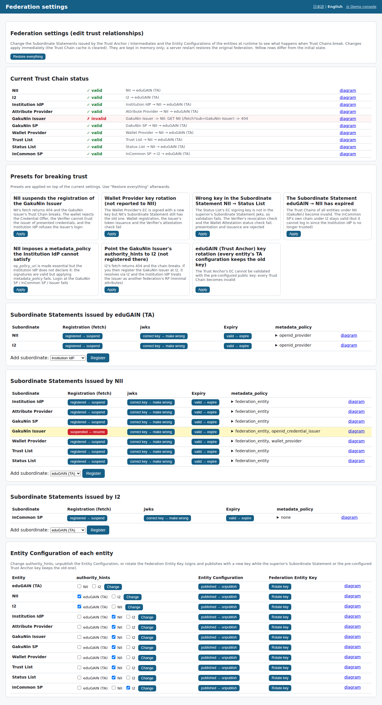

## Trust Map (who verifies whom, and how)

The **Trust Map** on the demo console (<http://localhost:8790/trust-map>) shows every trust decision made in the prototype
as an arrow from the verifying entity to the verified entity (defined in `src/services/trust-map.ts`).

- **Blue = OpenID Federation**: resolves the Trust Chain from the peer's Entity ID up to the eduGAIN Trust Anchor (whose public key is pre-configured everywhere)
  and uses keys and endpoints of a specific entity type in the resolved metadata (e.g. wallet → Issuer uses `openid_credential_issuer`)
- **Red = Trust List**: wallet → Verifier. The Verifier is outside the federation, so its access certificate (ETSI TS 119 411-8) is validated with the Access CA
  taken from the Trust List's LoTE (ETSI TS 119 602) (the Trust List itself is checked via the Federation)
- **Purple = Wallet Attestation**: Issuer / Verifier → Wallet Instance, checked with the attestation issued by the Wallet Provider, a PoP and the Status List
  (the Wallet Provider itself is checked via the Federation)

Click an entity to show only the arrows where it verifies (solid) and where it is verified (dashed).
The table below lists when each check happens, what is checked and where it is implemented, with a link to the peer's Trust Chain in the [Trust Chain Visualizer](#trust-chain-visualisation).

| Everything | Wallet Instance selected |
| --- | --- |
| 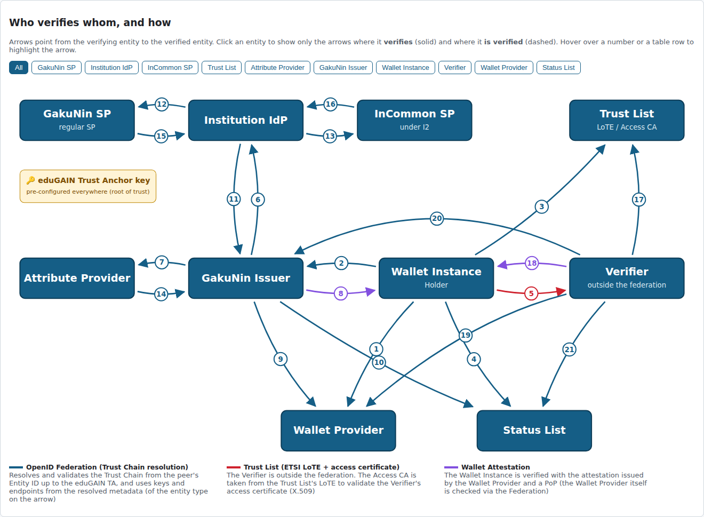 | 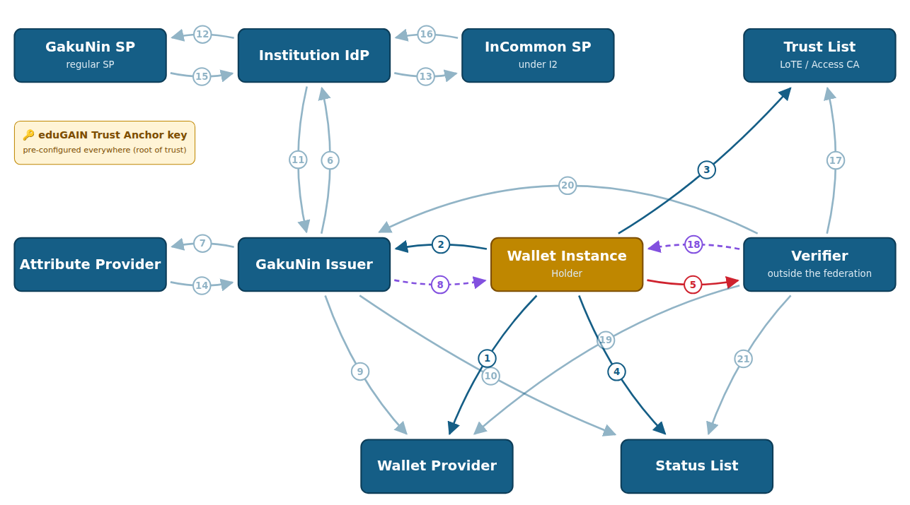 |

## Trust Chain visualisation

The **Trust Chain Visualizer** on the demo console (<http://localhost:8790/trust-chain>) and the InCommon SP's Trust Chain Explorer
actually run the Trust Chain resolution (OpenID Federation 1.0) for the chosen entity, trace it and draw it
(the `trace` option of `src/federation/resolver.ts`; drawing in `src/federation/trust-chain-view.ts`).

1. **Resolution path in the federation**: leaf → intermediate → Trust Anchor from bottom to top, with each entity's Entity Configuration (self-signed),
   the Subordinate Statements issued by superiors, `authority_hints` (dashed) and arrows showing which jwks verified which statement.
   The top is verified with the pre-configured Trust Anchor public key. Green means verified, red failed; numbers match the resolution steps
2. **Trust Chain (JWT array)**: `[Leaf EC, SS…, TA EC]` side by side, showing that the signing key of `[i]` is in `[i+1].jwks`, and the chain expiry (smallest exp). Each JWT can be decoded
3. **Resolution steps**: the HTTP fetches (`/.well-known/openid-federation`, `/fetch?sub=`) and signature checks in order (failures in red)
4. **Applying metadata_policy**: compares, per parameter, the leaf metadata, the policies of the superiors merged from the TA down, and the resolved metadata, highlighting changes

The Verifier is not a federation member (it is trusted via the Trust List), so choosing it is an example of a failing resolution (fetching its Entity Configuration fails).

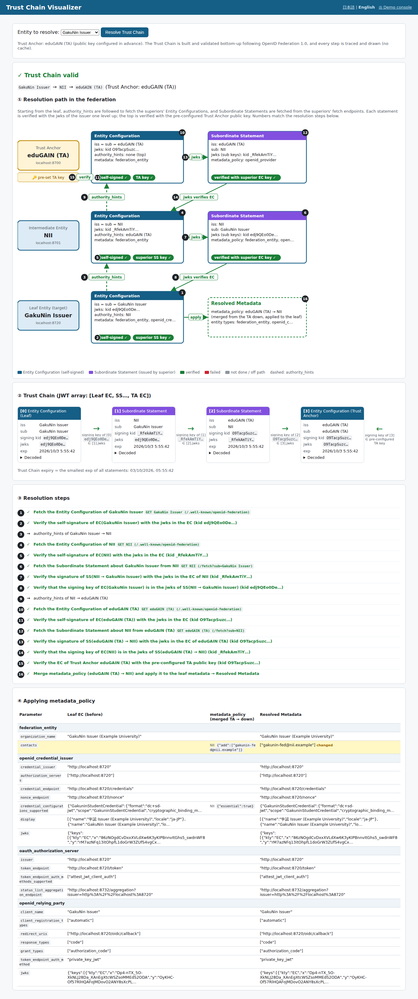

## Trust List (ETSI TS 119 602 / TS 119 411-8)

The Trust List follows the Relying Party trust model of the EUDI Wallet ecosystem
([ARF](https://github.com/eu-digital-identity-wallet/eudi-doc-architecture-and-reference-framework) 3.5 / 6.4 / 6.6.3.2,
[EUDI ETSI 119 6x2 library](https://github.com/eu-digital-identity-wallet/eudi-lib-kmp-etsi-1196x2)).
(docs.eudi.dev and spruceid.com could not be reached from the development environment, so the ARF and the EUDI reference implementation were used as the primary sources with the same content.)

```
 Verifier ──(1) registration (with PoP)──▶ Registrar ──▶ Access CA ──(2) issues the access certificate (WRPAC)
                                                           │ CRL
 LoTE Provider ──(3) lists the Access CA certificate in the WRPAC Providers LoTE (ETSI TS 119 602, JAdES-signed)
 Wallet ──(4) checks the LoTE signer via OpenID Federation → validates the LoTE → takes the trust anchors
        ──(5) validates the path of the Request Object x5c (WRPAC) to a trust anchor + CRL check (vcknots)
```

| Element | Standard | Implementation |
| --- | --- | --- |
| List of Trusted Entities | ETSI TS 119 602 (JSON) | `LoTE` / `ListAndSchemeInformation` / `TrustedEntitiesList` generated per ETSI's JSON schema (`src/trust-list/etsi119602.ts`). LoTEType `http://uri.etsi.org/19602/LoTEType/EUWRPACProvidersList`, service types `…/SvcType/WRPAC/Issuance` (Access CA certificate) and `…/SvcType/WRPAC/Revocation` (CRL). `LoTESequenceNumber` increases on changes, `NextUpdate` is 30 days later, `SchemeTerritory` is `JP` |
| LoTE signature | ETSI TS 119 182-1 (JAdES) | Compact JWS, payload `{"LoTE": …}`, protected header `alg`=ES256, `x5c`, `x5t#S256`, `sigT` (`crit: ["sigT"]`), `Content-Type: application/jwt` |
| Access certificate (WRPAC) | ETSI TS 119 411-8 | Legal-person policy NCP-l-eudiwrp (`0.4.0.194118.1.2`), subject with C / O / organizationIdentifier / CN, SAN with a dNSName (the `x509_san_dns` client_id) and a contact URI, keyUsage digitalSignature, AKI / SKI, CRL distribution point, AIA caIssuers, positive random serial |
| Access CA | RFC 5280 | CA certificate (pathLen 0, keyCertSign / cRLSign) and CRL. Suspending an RP revokes with `certificateHold`, cancelling with `cessationOfOperation` |
| Registrar | ARF 6.4 | RP registration API. The request is a JWS signed with the key to be certified (proof of possession). Registers the intended use and requested attributes (the registration certificate WRPRC is not implemented). Suspend / resume / cancel from the admin page |
| Wallet-side validation | ARF 6.6.3.2 | LoTE: checks the signer (Federation), JAdES, `LoTEVersionIdentifier`, `LoTEType`, `ListIssueDateTime`/`NextUpdate`, and takes the CA certificates of the WRPAC issuance service as trust anchors. WRPAC: end entity, digitalSignature, WRPAC policy, not self-signed, SAN matching client_id, path to a trust anchor. Signature and CRL revocation are checked by vcknots |

Tests: `npm test` validates the generated LoTE against ETSI's JSON schema (`test/fixtures/1960201_json_schema.json`) and checks the JAdES header.
`go test ./...` covers JAdES failure cases (untrusted signer, tampering, unknown `crit`, missing `sigT`).

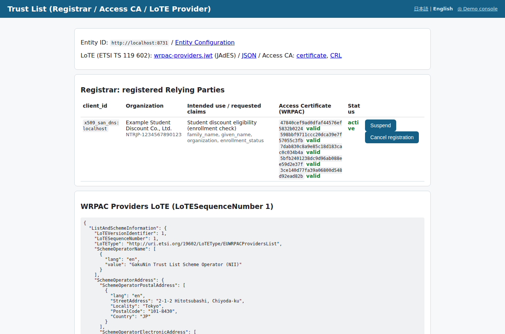

## Token Status List (draft-ietf-oauth-status-list)

The Status List is implemented per [draft-ietf-oauth-status-list](https://datatracker.ietf.org/doc/draft-ietf-oauth-status-list/).
Since datatracker could not be reached from the development environment, the WG editor's copy (oauth-wg/draft-ietf-oauth-status-list, equivalent to -21) was used.
The shared implementation is `src/status-list/token-status-list.ts`, the holder side (Go) is `wallet-instance/statuslist.go`.

| Item (draft section) | Implementation |
| --- | --- |
| Status List (4.1, 4.2) | `bits` = 2 (VALID / INVALID / SUSPENDED), 4096 entries. Packed from the LSB, DEFLATE + ZLIB (best compression) → base64url `lst`. With `aggregation_uri` |
| Status List Token (5.1) | JWT header `typ: statuslist+jwt`, claims `sub` (= the Status List URI), `iat`, `exp` (10 min), `ttl` (default 10 s, `STATUS_LIST_TTL`), `status_list` |
| Referenced Token (6.2) | `"status": {"status_list": {"idx": …, "uri": …}}` in the issuer-signed part of the SD-JWT VC |
| Status Types (7) | `0x00` VALID / `0x01` INVALID / `0x02` SUSPENDED. Suspend, reinstate and revoke from the Issuer admin page (INVALID is final; the Status Issuer refuses to change it back). `0x03` and `0x0C`-`0x0F` are shown as application-specific |
| Request / Response (8.1, 8.2) | `GET <uri>`, content negotiation with `Accept: application/statuslist+jwt` (406 when only CWT is requested), `Content-Type: application/statuslist+jwt`, CORS allowed |
| Validation Rules (8.3) | Validate the Referenced Token first (vcknots) → check `status`/`status_list`/`idx`/`uri` → fetch (bounded 3xx following) → `typ`, signature, required claims (`sub`/`iat`/`status_list`) → `sub` = `uri`, `exp`, `ttl` → decompress → reject out-of-range indexes → decide the Status Type. Anything but VALID is rejected |
| Caching (13.7) | The Verifier caches for `ttl` seconds after fetching (clamped to 5 s – 24 h, dropped after `exp`) |
| Historical Resolution (8.4) | `GET <uri>?time=<unix>` returns the Status List Token valid at that time (`iat` ≤ time < `exp`), 404 otherwise |
| Aggregation (9) | `GET /aggregation` → `{"status_lists": [...]}`. The Issuer publishes `status_list_aggregation_endpoint` in its OAuth AS metadata (and in the federation's `oauth_authorization_server`) |
| Index allocation (12.5, 13.2, 13.3) | Random unused indexes, never reused. Initial value 0x00 (VALID) |
| External Status Issuer (13.5) | The issuer of the Referenced Token (GakuNin Issuer) and the Status Issuer (Status List) are different entities, tied together (keys and trust) by OpenID Federation |

Tests: `npm test` (the draft's examples and the appendix test vectors for 1/2/4/8 bits, decoded and round-tripped in TypeScript),
`cd wallet-instance && go test ./...` (the same vectors in Go).

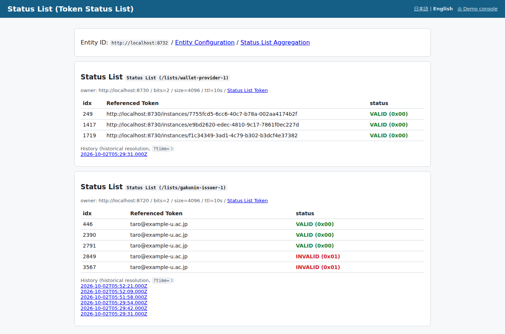

## Sequence

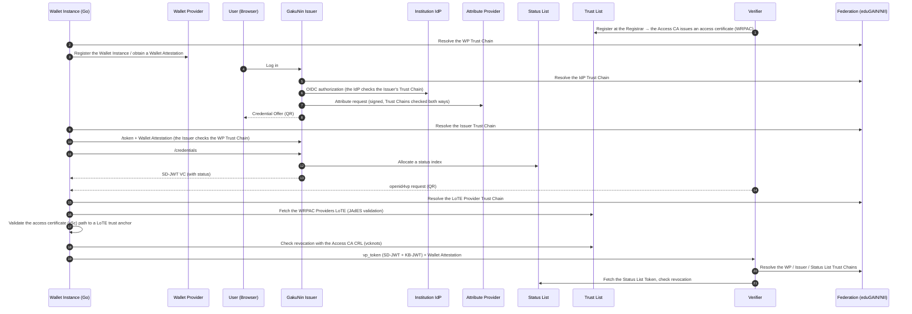

## Running from the CLI

### Requirements

- Node.js 22 or later
- Go 1.25 or later (required by the vcknots wallet; fetched automatically with `GOTOOLCHAIN=auto`)

### 1. Start the servers (all entities)

```bash
npm install
npm start
```

All entities start in one process on different ports, and the Verifier registers at the Registrar automatically to obtain its access certificate.
Keys are stored in `.data/keys/` so the same entity keys are used after a restart.
The Trust Anchor configuration (Entity ID and public key) is written to `.data/trust-anchor.json`; the Wallet Instance uses it as the out-of-band configured Trust Anchor.

### 2. Build the Wallet Instance

```bash
cd wallet-instance
go build -o wallet-instance .
./wallet-instance init        # registers with the Wallet Provider and obtains a Wallet Attestation
WALLET_LANG=en ./wallet-instance list   # CLI output in English
```

### 3. Issuance (browser + CLI)

1. Open <http://localhost:8720/> and "Log in with the Institution IdP" (demo users: `taro` / `hanako`, password `password`)
2. Check the obtained attributes and "Create Credential Offer"
3. Run the command shown

```bash
./wallet-instance receive 'openid-credential-offer://?credential_offer=...'
./wallet-instance list
```

### 4. Presentation

1. Open <http://localhost:8740/> and "Create presentation request"
2. Run the command shown (the result appears on the Verifier page automatically)

```bash
./wallet-instance present 'openid4vp:?client_id=x509_san_dns%3Alocalhost&request_uri=...'
# to choose the disclosed claims (default: the claims requested with DCQL)
./wallet-instance present '<uri>' --claims given_name,enrollment_status
```

### 5. Revocation and failure cases

- Suspend / reinstate / revoke: on <http://localhost:8720/admin> use "Suspend (SUSPENDED)", "Reinstate (VALID)", "Revoke (INVALID)" → presenting again is rejected by the Verifier with `SUSPENDED` / `INVALID`.
  The Verifier caches the Status List Token for `ttl` (default 10 s), so it can take up to `ttl` seconds. `./wallet-instance list` shows the status from the holder side too
- Suspending the Verifier: on <http://localhost:8731/> "Suspend" (certificateHold) or "Cancel registration" (cessationOfOperation) → the access certificate is revoked via the CRL and the wallet refuses to present. "Resume" restores it; after cancelling, "Register / re-register at the Registrar" on the Verifier page issues a new access certificate
- No Wallet Attestation: `curl -X POST http://localhost:8720/token -d ...` gives `invalid_client`
- Suspend / revoke / reactivate the Wallet Instance on <http://localhost:8730/> → the Status List entry referenced by the Wallet Attestation becomes SUSPENDED / INVALID and the Issuer and the Verifier reject it (after the ~10 s ttl). "Reactivate" restores it (from revoked, attestations are re-issued with a new entry)

### End-to-end script

With the servers running, the following runs login → issuance → presentation → suspend (rejected) → reinstate (accepted) → revoke (rejected) from the CLI only (about 40 s including the ttl waits).

```bash
./scripts/demo.sh          # as taro
./scripts/demo.sh hanako
```

### Screens

| GakuNin Issuer (after obtaining attributes) | Verifier (verification result) |
| --- | --- |
| 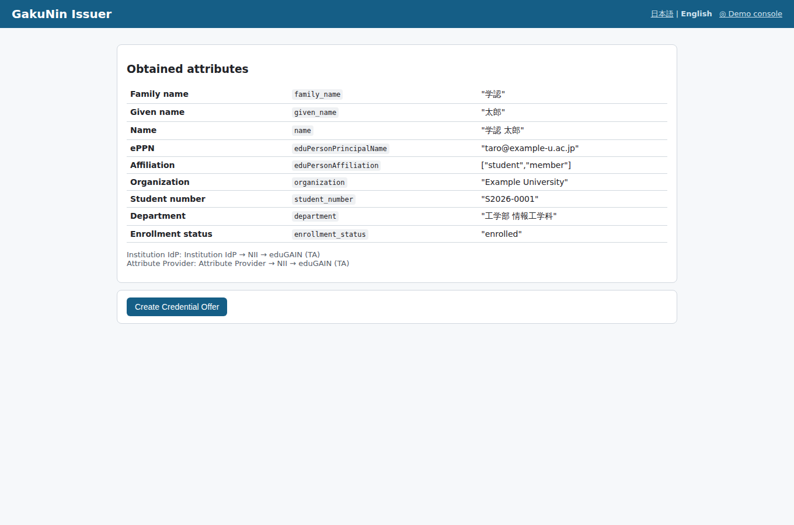 | 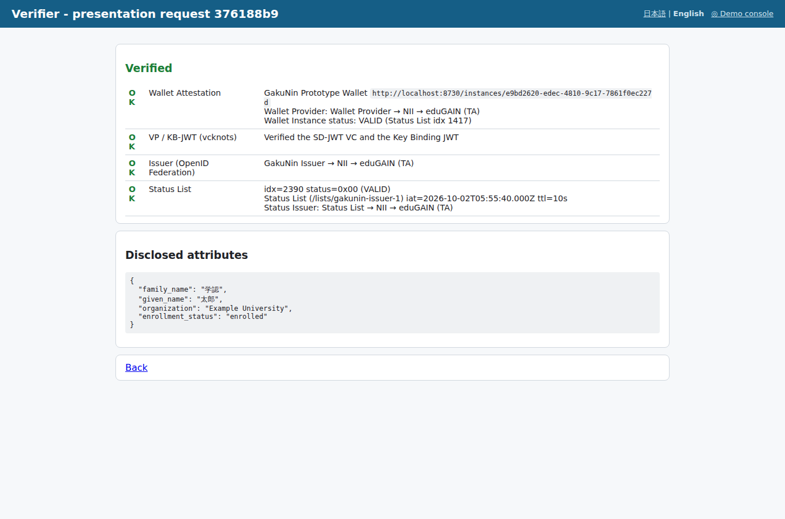 |

The Trust Chain Visualizer (<http://localhost:8790/trust-chain>) and the InCommon SP's Trust Chain Explorer (<http://localhost:8750/>) show each entity's Trust Chain resolution, the metadata after metadata_policy and the JWTs.

## Where vcknots is used, and notes

- **Issuer**: `initializeIssuerFlow` / `initializeAuthzFlow` (Pre-Authorized Code Flow, `dc+sd-jwt`).
  To keep the `status` claim out of selective disclosure (in the issuer-signed part), a provider wrapping the built-in `dc+sd-jwt`
  issuance provider is registered (`nonDisclosableClaims: ['status']`).
- **Authorization Server**: the Wallet Attestation is verified before vcknots' token endpoint processing, which then continues anonymously (pre-authorized_grant_anonymous_access).
- **Verifier**: `initializeVerifierFlow` (DCQL, x509_san_dns, Request Object by reference, KB-JWT validation).
  After vcknots' checks, the Wallet Attestation, the Issuer's Trust Chain and the Status List are checked.
- **Wallet**: `wallet.ReceiveCredential` / `wallet.PresentCredential`.
  - The vcknots wallet has no Wallet Attestation support, so `http.DefaultTransport` is wrapped to add the headers to form POSTs (token request / direct_post).
  - The vcknots Verifier serves a Request Object only once, so the Wallet Instance fetches it once from `request_uri` and passes it to vcknots as `request=` (by value). Signature, x5c path and CRL checks are done by vcknots with the trust anchors from the LoTE.

## Limitations of the prototype

- Everything runs on `http://localhost` (vcknots debug / `VCKNOTS_WALLET_HTTP_ALLOWED` enabled). Production requires HTTPS
- Keys (federation keys, protocol keys, VC signing key, Verifier certificate) and Status Lists are persisted in `.data/`.
  The Access CA key, certificates and issuance history, the Registrar's registrations and the LoTE sequence number are persisted in `.data/trust-list/`.
  The Wallet Provider's Wallet Instances (with their state) are in `.data/wallet-provider/`, the GakuNin Issuer's issuance history in `.data/issuer/`.
  Login sessions, pre-authorized codes of Credential Offers and the like are in memory and are lost on restart.
  The Web Wallet checks its registration with the Wallet Provider on startup and re-registers if it is not found.
  To reset everything, press "⟲ Reset all" on the demo console, or stop the servers and delete `.data/` (the Verifier re-registers at the Registrar on startup)
- Federation: Trust Marks, `constraints`, the Resolve endpoint and historical keys are not implemented. metadata_policy supports the main operators only (value / add / default / one_of / subset_of / superset_of / essential)
- The entity types `wallet_provider` / `trust_list_provider` / `status_list_provider` / `attribute_provider` are specific to this prototype (trusting the LoTE signer via OpenID Federation is also a combination specific to it; in EUDI the wallet is configured with the LoTE signer's trust anchor out of band)
- The LoTE type and service type URIs are the ETSI ones for EU WRPAC Providers (`SchemeTerritory` is `JP`). The Registrar, Access CA and LoTE Provider would normally be separate parties but are combined in one entity
- The Registrar does not verify RP identities and approves automatically. Registration certificates (WRPRC), the wallet-side check that requested attributes are within the registration, OCSP and ETSI TS 119 612 (XML Trusted List / LOTL) are not implemented
- The Wallet Provider does not verify key attestation / app integrity. The Status List management API (Issuer → Status Issuer) is protected with a shared secret. Status List Tokens are JWT only (no CWT)
- Adding a Wallet Attestation to the Verifier response is outside the OID4VP standard (an extension for this scenario)
- The Verifier is trusted through the Trust List (access certificate) and does not join the federation. client_id is `x509_san_dns:localhost` (a single Verifier)
- Demo user data (names, departments) and the Japanese entries of the protocol metadata (`display` with `locale: ja-JP`) stay in Japanese in the English UI
