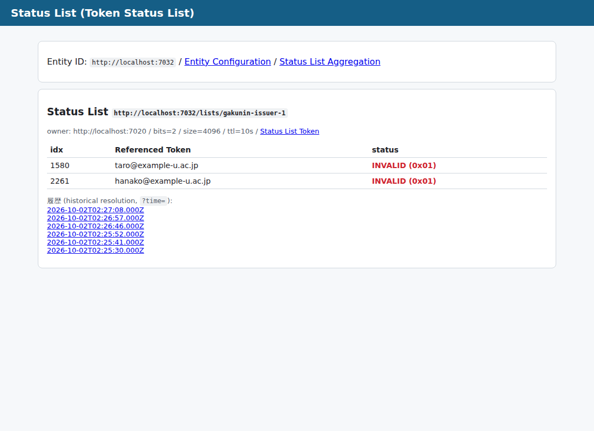
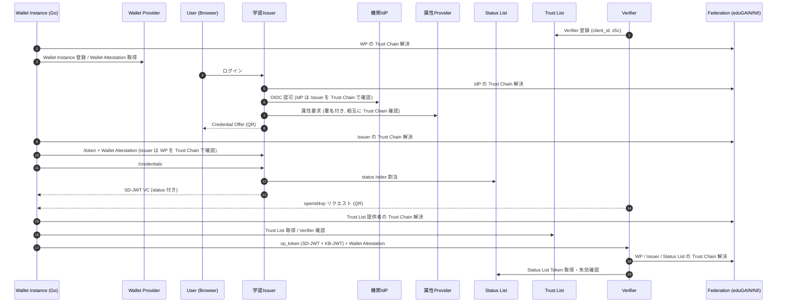
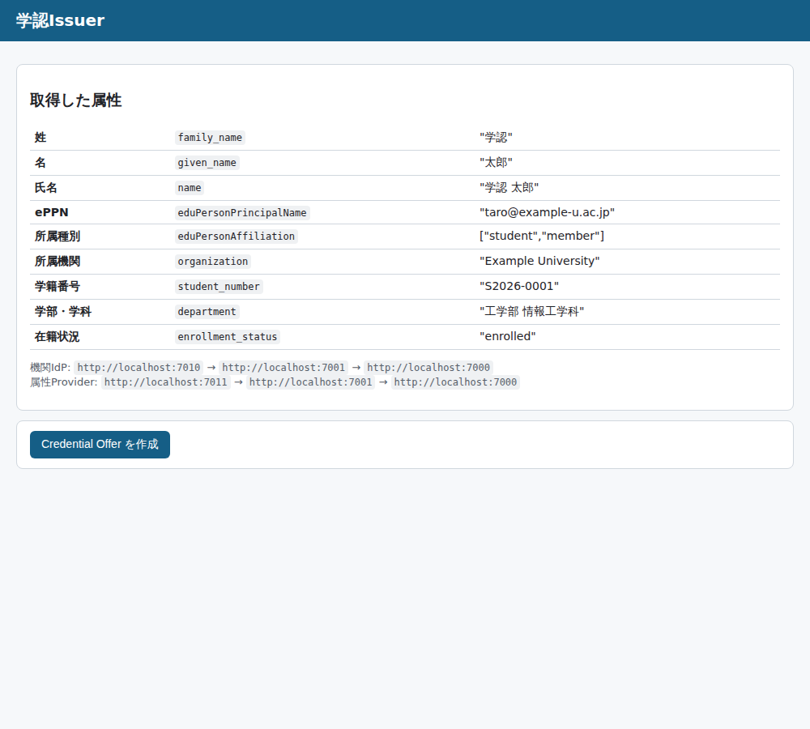
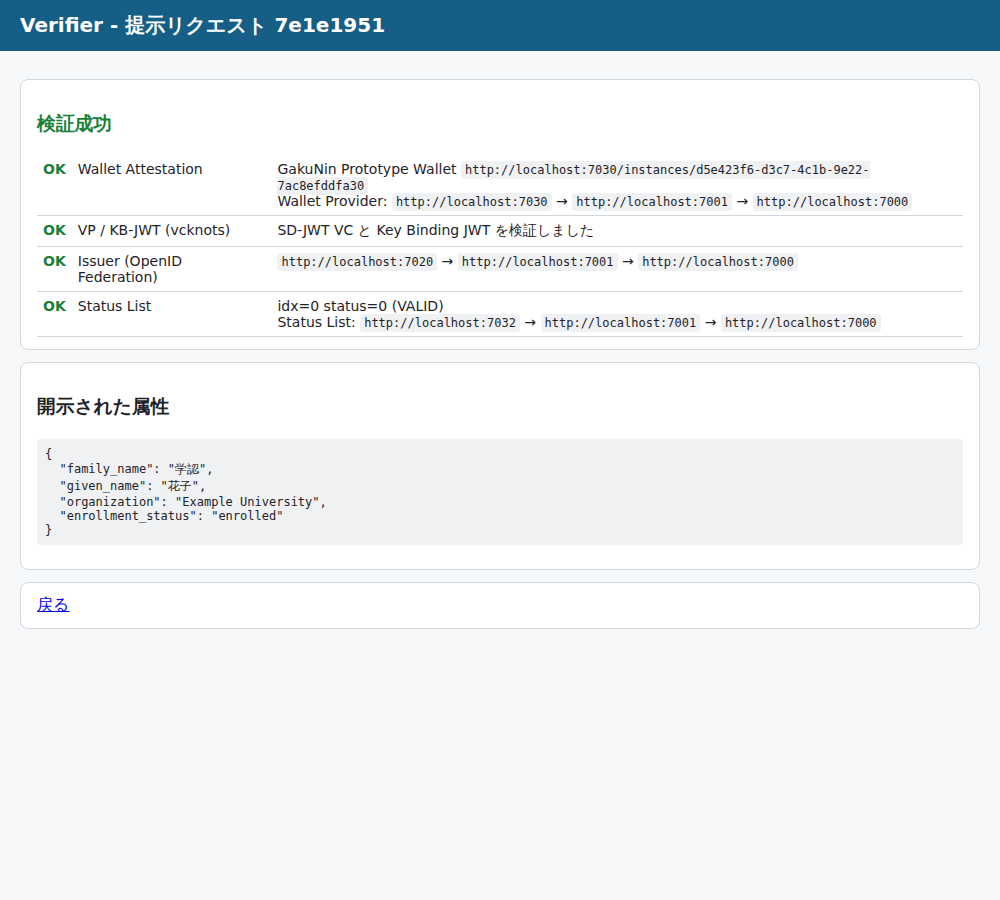

# 学認 IHV プロトタイプ (OpenID Federation + vcknots)

学認 (GakuNin) の IHV シナリオを、**OpenID Federation** による信頼チェーンの上で
**Issuer / Holder (Wallet) / Verifier** が動作するプロトタイプです。

- Issuer / Verifier: [vcknots](https://github.com/trustknots/vcknots) の TypeScript ライブラリ `@trustknots/vcknots` (OID4VCI / OID4VP, SD-JWT VC)
- Holder (Wallet Instance): vcknots の Go ウォレットライブラリ `github.com/trustknots/vcknots/wallet`
- OpenID Federation (Entity Configuration / Subordinate Statement / Trust Chain 解決 / metadata_policy)、Wallet Attestation、Trust List、Token Status List は本リポジトリで実装

通常の学認SPは対象外です (InCommon SP はフェデレーション間の信頼チェーン確認用のスタブ)。

## 構成 (図との対応)

```
                      Trust Anchor (eduGAIN) :7000
                       ▲                     ▲
       Intermediate Authority (NII) :7001   Intermediate Authority (I2) :7002
   ┌───────────┬──────────┬───────────┬──────────┬──────────┐        ▲
 機関IdP     属性Provider  学認Issuer   Wallet      Trust List  Status List   InCommon SP :7050
 :7010       :7011        :7020       Provider    :7031       :7032
                                      :7030         ▲
                                        ▲           │ Registration
                                        │ Registration
                                Wallet Instance   Verifier :7040
                                (Go CLI)
```

| 図の要素 | Entity ID | 実装 | 役割 |
| --- | --- | --- | --- |
| Trust Anchor (eduGAIN) | `http://localhost:7000` | `src/services/authority.ts` | 信頼の起点。NII / I2 を下位に登録し、eduGAIN 全体の `metadata_policy` を適用 |
| Intermediate Authority (NII) | `http://localhost:7001` | `src/services/authority.ts` | 学認の中間機関。学認IdP / 学認SP / IHV 関連エンティティを登録 |
| Intermediate Authority (I2) | `http://localhost:7002` | `src/services/authority.ts` | InCommon の中間機関 |
| 機関IdP | `http://localhost:7010` | `src/services/idp.ts` | OpenID Provider。RP を **Federation の automatic registration** で受け入れ (redirect_uris / jwks は Trust Chain 解決後のメタデータから取得) |
| 属性Provider | `http://localhost:7011` | `src/services/attribute-provider.ts` | 学籍番号・学部などの追加属性を返す。要求者を Trust Chain で検証し、応答に署名 |
| 学認Issuer (学認SPとして構成) | `http://localhost:7020` | `src/services/issuer.ts` | vcknots IssuerFlow / AuthzFlow。機関IdP でログイン → 属性Provider → SD-JWT VC を発行 |
| Wallet Provider | `http://localhost:7030` | `src/services/wallet-provider.ts` | Wallet Instance 登録と Wallet Attestation (`oauth-client-attestation+jwt`) 発行 |
| Trust List | `http://localhost:7031` | `src/services/trust-list.ts` | Verifier の登録簿。署名付きリスト (`trust-list+jwt`) を配布 |
| Status List | `http://localhost:7032` | `src/services/status-list.ts` | [Token Status List (draft-ietf-oauth-status-list)](https://datatracker.ietf.org/doc/draft-ietf-oauth-status-list/) の Status Issuer / Status Provider |
| Verifiers | `http://localhost:7040` | `src/services/verifier.ts` | vcknots VerifierFlow (OID4VP, x509_san_dns + JAR)。起動時に Trust List へ登録 |
| Wallet Instance | (CLI) | `wallet-instance/` (Go) | vcknots Go ウォレット + Wallet Attestation / Federation / Trust List 検証 |
| InCommon SP | `http://localhost:7050` | `src/services/incommon-sp.ts` | I2 配下の RP。Trust Chain Explorer として任意のエンティティの信頼チェーンを表示 |

OpenID Federation 部分は `src/federation/` (TypeScript) と `wallet-instance/federation.go` (Go) にあります。

## IHV シナリオの各ポイントの実装

| シナリオ | 実装 |
| --- | --- |
| Issuer/Verifier が Wallet を信頼するために、Wallet Instance が提示する Wallet Attestation を Wallet Provider の公開鍵で検証する | Wallet Instance は OID4VCI の token request と OID4VP の direct_post に `OAuth-Client-Attestation` / `OAuth-Client-Attestation-PoP` ヘッダ (draft-ietf-oauth-attestation-based-client-auth) を付与。Issuer の `/token` と Verifier の `/callback` で検証 (`src/common/wallet-attestation.ts`) |
| その際、Wallet Provider の正当性を OpenID Federation で検証する (Wallet Provider は複数存在してもよい) | Attestation の `iss` から Trust Chain を解決し、`wallet_provider` メタデータの `jwks` で署名検証。Wallet Provider を固定せず、Trust Anchor に繋がる任意の Wallet Provider を受け入れる |
| Wallet が Verifier を信頼するために Trust List を照会する | Wallet Instance は `client_id` を Trust List で検索し、登録された証明書を **vcknots の `X509TrustChainRoots`** に渡して Request Object (x5c) を検証 (`wallet-instance/trustlist.go`) |
| その際、Trust List の正当性を OpenID Federation で検証する | Trust List 提供者の Trust Chain を解決し、`trust_list_provider.jwks` で `trust-list+jwt` の署名を検証 |
| Verifier は Credential の失効確認を Status List へ照会して行う | Issuer は発行時に Status List から index を割り当て、SD-JWT VC の (非選択開示の) `status.status_list` (`idx`, `uri`) に埋め込む。Verifier は draft の Validation Rules に従って Status List Token を取得・検証し、VALID / INVALID / SUSPENDED を判定 ([下記](#token-status-list-draft-ietf-oauth-status-list)) |
| その際、Status List の正当性を OpenID Federation で検証する | Status List Token の `iss` (Status Issuer) の Trust Chain を解決し、`status_list_provider.jwks` で署名検証 (draft の Key Resolution and Trust Management を本エコシステム向けに規定) |
| 学認IdP / 学認SP としての構成 | 学認Issuer は `openid_relying_party` メタデータを持つ学認SPとして NII 配下に登録。機関IdP・属性Provider は Issuer を、Issuer は IdP・属性Provider を、それぞれ Trust Chain で相互に確認 |
| (追加) Wallet が Issuer を信頼する | Credential Offer の `credential_issuer` の Trust Chain を解決し、`openid_credential_issuer` として登録されていることを確認 |
| (追加) Verifier が Issuer を信頼する | SD-JWT VC の `iss` の Trust Chain を解決し、フェデレーションメタデータ (`openid_credential_issuer.jwks`) の鍵でも署名を検証 |

### metadata_policy の例

- eduGAIN → NII / I2: `openid_provider.id_token_signing_alg_values_supported` を `subset_of [ES256, ES384, PS256]` に制限
  (機関IdP は `RS256` も宣言しているが、解決後メタデータからは除去される。InCommon SP の Explorer で確認可能)
- NII → 各リーフ: `federation_entity.contacts` に `add`、Issuer には `credential_configurations_supported` を `essential`、
  Wallet Provider には `attestation_signing_alg_values_supported` を `subset_of [ES256]`

## Token Status List (draft-ietf-oauth-status-list)

Status List は [draft-ietf-oauth-status-list](https://datatracker.ietf.org/doc/draft-ietf-oauth-status-list/) に従って実装しています。
datatracker はこの環境から参照できないため、WG の編集版 (oauth-wg/draft-ietf-oauth-status-list, -21 相当) を参照しました。
共通実装は `src/status-list/token-status-list.ts`、Holder 側 (Go) は `wallet-instance/statuslist.go` です。

| 項目 (draft の節) | 実装 |
| --- | --- |
| Status List (4.1, 4.2) | `bits` = 2 (VALID / INVALID / SUSPENDED を表現)、4096 エントリ。LSB から詰めて DEFLATE + ZLIB (最高圧縮レベル) → base64url の `lst`。`aggregation_uri` 付き |
| Status List Token (5.1) | JWT ヘッダ `typ: statuslist+jwt`、クレーム `sub` (= Status List の URI)、`iat`、`exp` (10 分)、`ttl` (既定 10 秒、`STATUS_LIST_TTL` で変更)、`status_list` |
| Referenced Token (6.2) | SD-JWT VC の Issuer 署名部に `"status": {"status_list": {"idx": …, "uri": …}}` |
| Status Types (7) | `0x00` VALID / `0x01` INVALID / `0x02` SUSPENDED。Issuer 管理画面から一時停止・再開・失効が可能 (INVALID は終端状態として Status Issuer が戻しを拒否)。`0x03`・`0x0C`-`0x0F` はアプリ固有として表示 |
| Request / Response (8.1, 8.2) | `GET <uri>`、`Accept: application/statuslist+jwt` のコンテンツネゴシエーション (CWT のみ要求された場合は 406)、`Content-Type: application/statuslist+jwt`、CORS 許可 |
| Validation Rules (8.3) | Referenced Token を先に検証 (vcknots) → `status`/`status_list`/`idx`/`uri` の検査 → 取得 (3xx 追従は上限付き) → `typ`・署名・必須クレーム (`sub`/`iat`/`status_list`) → `sub` = `uri`・`exp`・`ttl` → 伸長 → 範囲外 index は拒否 → Status Type 判定。VALID 以外は拒否 |
| キャッシュ (13.7) | Verifier は取得から `ttl` 秒キャッシュ (下限 5 秒・上限 24 時間で丸め、`exp` 超過時は破棄) |
| Historical Resolution (8.4) | `GET <uri>?time=<unix>` で、その時点で有効だった Status List Token を返す (`iat` ≦ time < `exp`)。範囲外は 404 |
| Aggregation (9) | `GET /aggregation` → `{"status_lists": [...]}`。Issuer は OAuth AS メタデータ (と Federation の `oauth_authorization_server`) に `status_list_aggregation_endpoint` を公開 |
| インデックス割当 (12.5, 13.2, 13.3) | 未使用インデックスからランダムに割当て、再利用しない。初期値は 0x00 (VALID) |
| External Status Issuer (13.5) | Referenced Token の Issuer (学認Issuer) と Status Issuer (Status List) は別エンティティ。鍵と信頼は OpenID Federation で結び付け |

テスト: `npm test` (draft の例と付録のテストベクタ 1/2/4/8-bit を TypeScript でデコード・往復検証)、
`cd wallet-instance && go test ./...` (同じベクタを Go で検証)。



## シーケンス



## 動かし方

### 必要なもの

- Node.js 22 以上
- Go 1.25 以上 (vcknots ウォレットの要件。`GOTOOLCHAIN=auto` なら自動取得されます)

### 1. サーバー (全エンティティ) を起動

```bash
npm install
npm start
```

すべてのエンティティが 1 プロセスで別ポートに起動し、Verifier は Trust List に自動登録されます。
鍵は `.data/keys/` に保存され再起動後も同じ Entity 鍵が使われます。
Trust Anchor の設定 (Entity ID と公開鍵) は `.data/trust-anchor.json` に出力され、Wallet Instance はこれを帯域外で設定された Trust Anchor として使います。

### 2. Wallet Instance をビルド

```bash
cd wallet-instance
go build -o wallet-instance .
./wallet-instance init        # Wallet Provider へ登録し Wallet Attestation を取得
```

### 3. 発行 (ブラウザ + CLI)

1. <http://localhost:7020/> を開き「機関IdPでログイン」(デモユーザー: `taro` / `hanako`、パスワード `password`)
2. 取得した属性を確認し「Credential Offer を作成」
3. 表示されたコマンドを実行

```bash
./wallet-instance receive 'openid-credential-offer://?credential_offer=...'
./wallet-instance list
```

### 4. 提示

1. <http://localhost:7040/> を開き「提示リクエストを作成」
2. 表示されたコマンドを実行 (結果は Verifier の画面に自動反映)

```bash
./wallet-instance present 'openid4vp:?client_id=x509_san_dns%3Alocalhost&request_uri=...'
# 開示するクレームを指定する場合 (既定は DCQL で要求されたクレーム)
./wallet-instance present '<uri>' --claims given_name,enrollment_status
```

### 5. 失効・不正系の確認

- 一時停止 / 再開 / 失効: <http://localhost:7020/admin> で「一時停止 (SUSPENDED)」「再開 (VALID)」「失効 (INVALID)」→ 再提示すると Verifier が `SUSPENDED` / `INVALID` で拒否。
  Verifier は Status List Token を `ttl` (既定 10 秒) キャッシュするため、反映まで最大 `ttl` 秒かかります。`./wallet-instance list` でも Holder 側から状態を確認できます
- Verifier を信頼しない: <http://localhost:7031/> で Verifier を削除 → Wallet が提示を拒否 (Verifier 画面の「Trust List へ登録 / 再登録」で戻せます)
- Wallet Attestation なし: `curl -X POST http://localhost:7020/token -d ...` は `invalid_client`
- Wallet Instance 失効: <http://localhost:7030/> で失効 → 以後の Attestation 取得が拒否されます (発行済み Attestation は有効期限 1 時間まで有効)

### 一括デモ

サーバー起動後に以下を実行すると、ログイン → 発行 → 提示 → 一時停止 (拒否) → 再開 (成功) → 失効 (拒否) までを CLI だけで実行します (ttl 待ちを含め約 40 秒)。

```bash
./scripts/demo.sh          # taro で実行
./scripts/demo.sh hanako
```

### 画面

| 学認Issuer (属性取得後) | Verifier (検証結果) |
| --- | --- |
|  |  |

InCommon SP の Trust Chain Explorer (<http://localhost:7050/>) で、各エンティティの Trust Chain・metadata_policy 適用後のメタデータ・JWT を確認できます。

## vcknots の利用箇所と補足

- **Issuer**: `initializeIssuerFlow` / `initializeAuthzFlow` (Pre-Authorized Code Flow, `dc+sd-jwt`)。
  `status` クレームを選択的開示の対象外 (Issuer 署名部) に置くため、組み込みの `dc+sd-jwt` 発行プロバイダをラップした
  プロバイダを登録しています (`nonDisclosableClaims: ['status']`)。
- **Authorization Server**: vcknots の token endpoint 処理の前段で Wallet Attestation を検証し、その後は匿名 (pre-authorized_grant_anonymous_access) として vcknots に委譲しています。
- **Verifier**: `initializeVerifierFlow` (DCQL, x509_san_dns, Request Object by reference, KB-JWT 検証)。
  vcknots の検証後に、Wallet Attestation・Issuer の Trust Chain・Status List の確認を追加しています。
- **Wallet**: `wallet.ReceiveCredential` / `wallet.PresentCredential`。
  - vcknots ウォレットは Wallet Attestation 未対応のため、`http.DefaultTransport` をラップして form POST (token request / direct_post) にヘッダを付与しています。
  - vcknots の Verifier は Request Object を 1 回しか返さないため、Wallet Instance が `request_uri` から一度だけ取得し、`request=` (by value) で vcknots に渡します。署名・x5c の検証は vcknots が Trust List 由来の証明書で行います。

## プロトタイプとしての制約

- すべて `http://localhost` (vcknots の debug / `VCKNOTS_WALLET_HTTP_ALLOWED` を有効化)。本番では HTTPS 必須
- 鍵 (Federation 鍵・各プロトコル鍵・VC 署名鍵・Verifier 証明書) と Status List は `.data/` に永続化。
  それ以外 (Wallet Instance の登録、発行履歴、Trust List 登録、ログインセッション) はインメモリで、サーバー再起動で消えます
  (Wallet Instance は未登録エラー時に自動で再登録し、Verifier は起動時に Trust List へ再登録します)
- Federation: Trust Mark、`constraints`、Resolve endpoint、Historical keys は未実装。metadata_policy は主要オペレーター (value / add / default / one_of / subset_of / superset_of / essential) のみ
- Entity Type `wallet_provider` / `trust_list_provider` / `status_list_provider` / `attribute_provider` と Trust List の形式 (`trust-list+jwt`) は本プロトタイプ独自
- Wallet Provider は鍵アテステーション / アプリ完全性検証を行っていません。Status List の管理 API (Issuer → Status Issuer) は共有シークレットで保護。Status List Token は JWT 形式のみ (CWT 形式は未対応)
- Verifier 応答への Wallet Attestation 付与は OID4VP 標準の範囲外 (本シナリオ用の拡張)
- Verifier は Trust List で信頼される前提のため Federation には参加していません。client_id は `x509_san_dns:localhost` (Verifier は 1 つ)
